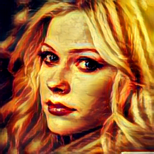

## Learning Transformation Matrices for Artistic Universal Style Transfer
**[[Implemented Paper]](http://openaccess.thecvf.com/content_CVPR_2019/papers/Li_Learning_Linear_Transformations_for_Fast_Image_and_Video_Style_Transfer_CVPR_2019_paper.pdf)**



## Prerequisites
- [Pytorch](http://pytorch.org/)
- [torchvision](https://github.com/pytorch/vision)

**All code has been tested on Windows 10, NVIDIA GeForce GTX 1060 and pytorch 0.4.1**

## Style Transfer
- Clone from github: `git clone https://github.com/ssaraff98/LinearStyleTransferHistogram`

#### Artistic style transfer
To test style transfer on relu_41 features
```
python TestArtistic.py
```
To test style transfer on relu_31 features
```
python TestArtistic.py --vgg_dir models/vgg_r31.pth --decoder_dir models/dec_r31.pth --matrixPath models/r31.pth --layer r31
```
**Pre-trained model with the original loss function has been saved to models/original_r31.pth**
**Default output directory is Artistic. Change output directory by adding option --outf OUTPUT_DIR**

## Model Training
### Data Preparation
- MSCOCO - Content Images
```
wget http://msvocds.blob.core.windows.net/coco2014/train2014.zip
```
- WikiArt - Style Images
  - Either manually download from [kaggle](https://www.kaggle.com/c/painter-by-numbers).
  - Or install [kaggle-cli](https://github.com/floydwch/kaggle-cli) and download by running:
  ```
  kg download -u <username> -p <password> -c painter-by-numbers -f train.zip
  ```

### Training
#### Train a style transfer model
To train a model that transfers relu4_1 features, run:
```
python Train.py --vgg_dir models/vgg_r41.pth --decoder_dir models/dec_r41.pth --layer r41 --contentPath PATH_TO_MSCOCO --stylePath PATH_TO_WikiArt --outf OUTPUT_DIR
```
To train a model that transfers relu3_1 features:
```
python Train.py --vgg_dir models/vgg_r31.pth --decoder_dir models/dec_r31.pth --layer r31 --contentPath PATH_TO_MSCOCO --stylePath PATH_TO_WikiArt --outf OUTPUT_DIR
```
Key hyper-parameters:
- style_layers: which features to compute style loss.
- style_weight: larger style weight leads to heavier style in transferred images.

Intermediate results and weight will be stored in `OUTPUT_DIR`

### Code Adaptations and Modifications
Code cloned from [LinearStyleTransfer](https://github.com/sunshineatnoon/LinearStyleTransfer) by [sunshineatnoon](https://github.com/sunshineatnoon).
Referenced TensorFlow version of [histogram loss](https://github.com/rejunity/neural-style-tf/) by [rejunity](https://github.com/rejunity) for PyTorch implementation for my new loss function.

#### Files changed
- Train.py
  - Added options for user to input histogram layers, histogram loss weight, number of histogram bins, total variational loss layers and total variational loss weight.
  - Modified loss criterion call to pass in extra parameters for histogram and total variational loss
- libs/Criterion.py
  - Added class histogramLoss() to calculate histogram loss between transformed output features and input style features at different style layers.
    - Added functions to compress and decompress features to fit data better.
    - Added a function to feature-wise match the histogram of transformed output features to input style features.
  - Added class tvLoss() to calculate the total variational loss

#### Files added
- libs/Histogram.py
  - Added function matchHistogram() to match the histogram of transformed output features to input style features.
  - Added function linearInterpolation() to calculate the remapped values using linear interpolation.
  - Added function sortSearch() to get the indices of the values to be searched in the histogram bins.
  - Added function fixedWidthHistogram() to map values to within a fixed width of histogram bins.

Online spotlight presentation at https://youtu.be/DGVHYf1Sr-s
